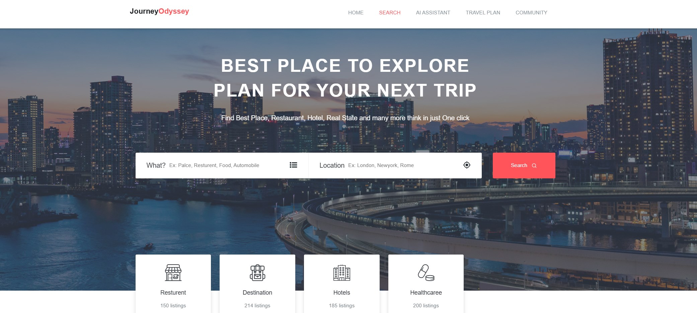
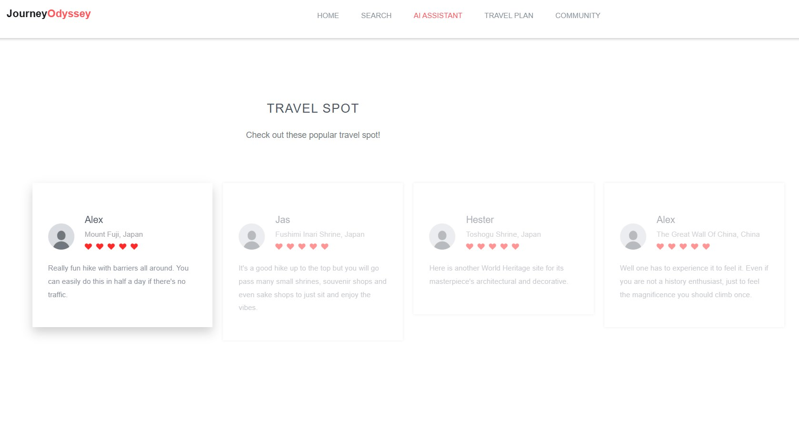
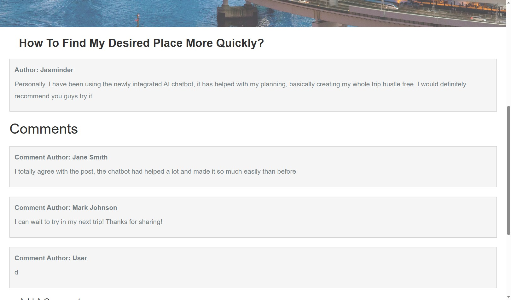
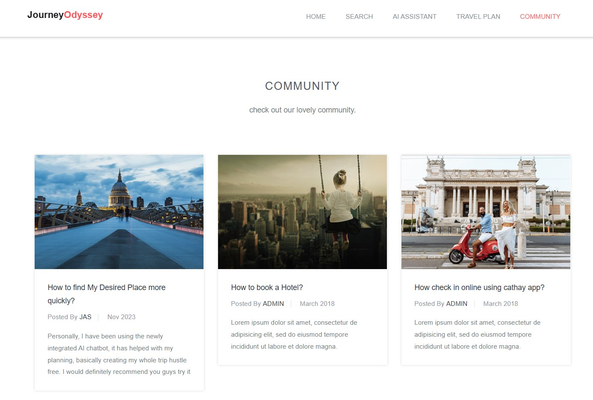
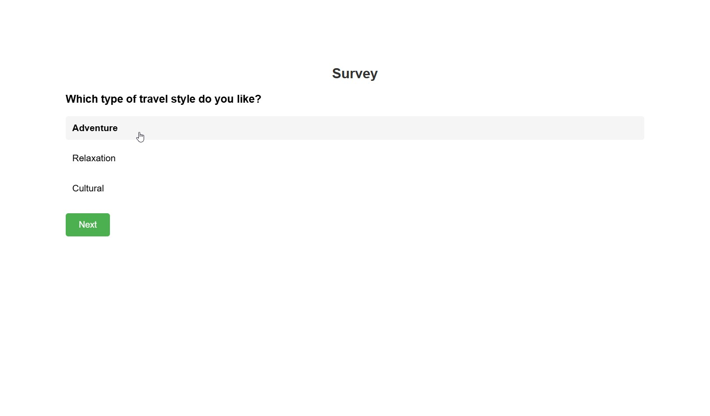

-----------------------
# README
-----------------------

Team 264 - DebugHero

- - - 

---

# Cathay Hackathon 2023 — Low-Cost Travel Experience Prototype

> This project represents an early-stage prototype in my hackathon journey.

## Overview

This project was developed during the Cathay Hackathon 2023 as an early-stage prototype focusing on improving the digital travel experience from pre-booking to post-flight engagement.

At the time, the implementation was built using only HTML, CSS, and JavaScript without a backend system. The goal was to validate product ideas and demonstrate a conceptual end-to-end travel experience.

---

## Problem Statement

The challenge focused on improving:

* Digital travel experience across the entire journey lifecycle
* Sustainability tracking for fuel consumption and carbon emissions
* Flight safety enhancement through technology
* Operational efficiency for low-cost carrier planning

---

## Solution Concept

Our solution explored a **community-driven travel platform** where users could:

* Discover and review travel spots
* Share travel experiences and recommendations
* Explore budget-based travel suggestions
* Improve travel decision-making through community insights

---

## Key Features (Prototype Stage)

* Static web-based travel experience interface
* Community-style travel spot browsing concept
* Budget-based travel exploration flow
* Early-stage UX for pre-booking inspiration

---

## Tech Stack

* HTML
* CSS
* JavaScript

(No backend was implemented due to hackathon time constraints)

---

## UI / Prototype Screens

  
  

  
  

  

---

## Pitching Video

A short presentation explaining the concept, user flow, and design thinking.

https://youtu.be/oC8ipIhxHAs

---

## What I Learned

* Translating a complex airline problem into a simplified product concept
* Designing user experience flows without backend support
* Working within strict technical constraints (frontend-only prototype)
* Communicating product ideas effectively through pitching
* Early understanding of travel tech ecosystem and user needs

---

## Project Reflection

This project represents my early-stage thinking in product design and web development. While technically simple, it laid the foundation for later work involving full-stack architecture, AI integration, and system design (as seen in the 2024 hackathon project).

---

